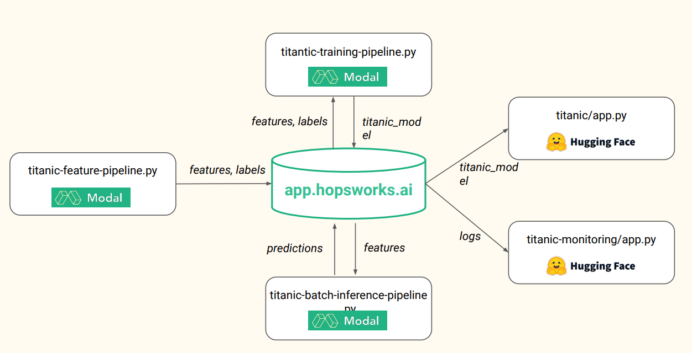

# Titanic Survival in Real Time
A machine learning model was trained to predict titanic survival and deployed as a Serverless ML System using Hopsworks, Modal and HuggingFace.

The steps were the following:
1. A feature pipeline was created to use only the useful features in our model, clean the dataset and save it into a Feature Group in Hopsworks.
2. A training pipeline was created to train the model on the dataset with RandomForestClassifier using all the features selected in the previous step except the id. The dataset is split into train and test (test set to 20%). The accuracy score on the test set is 83.24%.
3. An User Interface was created with gradio UI and deployed on HuggingFace to enable Predictive Analytics so the user can use the model.
4. An inference pipeline

The system architecture is the following: 

HuggingFace links:
* Application: 
* Monitor: 
